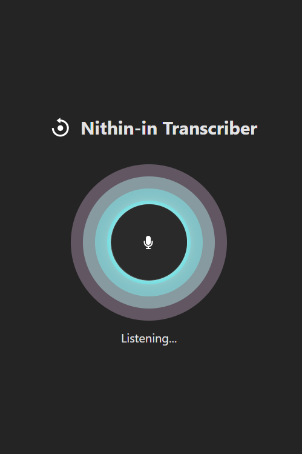

# 🎙️ AI-integrated-Transcriber

A voice-based transcription and AI response generator powered by **Google Gemini** and **React Speech Recognition**. This app records speech, transcribes it in real-time, and sends the result to Gemini for intelligent interpretation and feedback.

## 🚀 Features

- 🎤 Real-time speech-to-text using `react-speech-recognition`
- 🤖 AI response generation using Google's `@google/generative-ai`
- ⚡ Fast and responsive interface with Vite and React
- 🌀 Simple microphone control for recording
- 🔁 Easy reset functionality to clear transcriptions and AI outputs

## 📸 Demo

> *Hold the mic button to record voice input, release to generate AI response.*



---

## 🧠 How It Works

1. User presses the mic button to start recording.
2. Audio is transcribed live via `react-speech-recognition`.
3. On release, the transcript is sent to Google Gemini using the `@google/generative-ai` SDK.
4. AI response is fetched and rendered below the transcription.

---

## 🛠️ Tech Stack

- **React** + **Vite** – Fast front-end framework and bundler
- **React Speech Recognition** – Voice transcription
- **Google Generative AI SDK** – AI prompt processing
- **CSS / Icons** – Custom UI with `react-icons`

---

## 🔧 Setup Instructions

### 1. Clone the Repository

```bash
git clone https://github.com/Nithinbharathi93/AI-integrated-Transcriber
cd AI-integrated-Transcriber
````

### 2. Install Dependencies

```bash
npm install
```

### 3. Configure Environment Variables

Create a `.env` file in the root directory and add:

```env
VITE_API_KEY=your_google_gemini_api_key
VITE_PROMPT=Act as a helpful assistant and summarize or respond appropriately to the transcript.
```

> Replace the `VITE_API_KEY` with your actual API key from [Google AI Studio](https://makersuite.google.com/).

---

### 4. Run the Development Server

```bash
npm run dev
```

Open your browser at [http://localhost:5173](http://localhost:5173)

---

## 📂 Folder Structure

```
/AI-integrated-Transcriber
├── public/
├── src/
│   └── App.jsx         # Main logic and UI
├── .env                # API keys and prompt
├── package.json
└── vite.config.js
```

---

## 🧪 Key Dependencies

```json
{
  "@google/generative-ai": "^0.x",
  "react-speech-recognition": "^3.x",
  "react-icons": "^4.x"
}
```

---

## 📌 Usage Tips

* Ensure your browser supports the Web Speech API.
* Use a headset mic for clearer transcription.
* Hold and release the mic button to start/stop recording.
* Adjust the prompt in `.env` for different response styles (e.g., summarization, translation, tone adjustment).

---

## 🧑‍💻 Author

**Nithinbharathi T**
[GitHub](https://github.com/nithinbharathi93) | [LinkedIn](https://linkedin.com/in/nithinbharathi)

---
